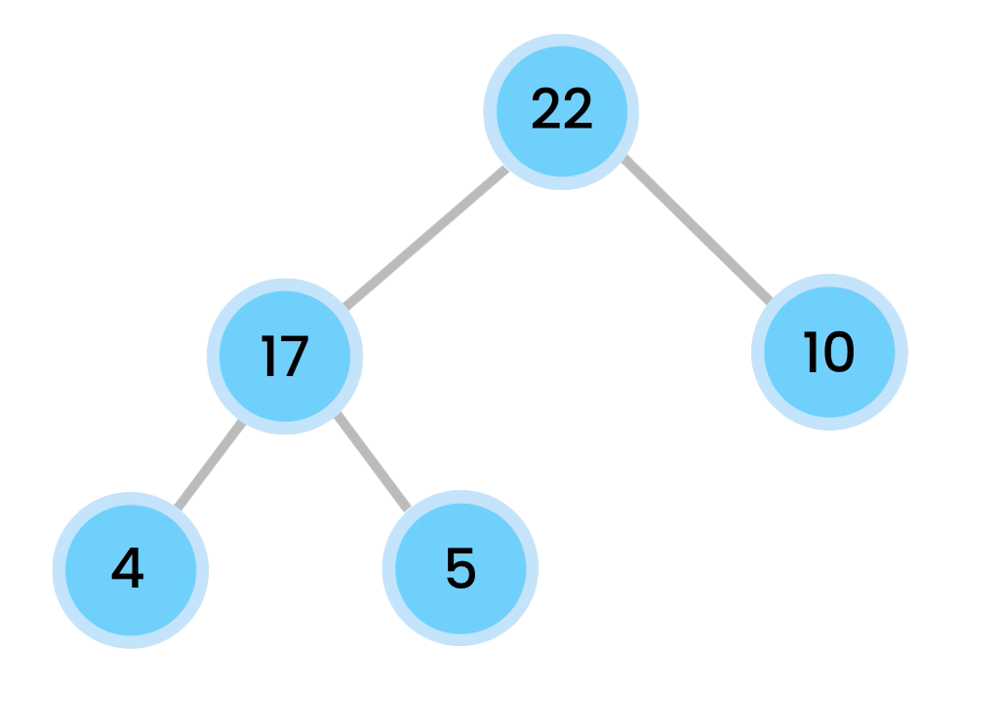

# Heaps

A heap is a specialized data structure that allows for efficient access and manipulation of elements based on their priority. In a heap, each element is associated with a priority value and elements are stored in such a way that the highest (or lowest) priority element can be quickly accessed.

  

Heaps are commonly used in computer science, especially in algorithms where a large number of elements need to be processed in priority order. Some common use cases for heaps include finding the kth-largest value in a set of elements, sorting an array, implementing priority queues, and performing heapify operations on arrays.

---

## Importance of Heaps and Their Applications

### Kth-Largest Value

One application of heaps is to find the kth-largest value in a set of elements. This can be accomplished by creating a min heap of size k and inserting each element into the heap. If the size of the heap exceeds k, then the smallest element is removed. Once all the elements have been inserted, the root of the min heap will be the kth-largest element.

### Heapify

Heapify is the process of converting an array of elements into a heap. This can be done in linear time by iterating through each element and "bubbling down" the element to its correct position. This operation is used to create a heap from an unsorted array or to maintain the heap property when an element is added or removed.

### Heap Sort

Heap sort is an efficient in-place sorting algorithm that uses a heap to sort an array. The algorithm works by creating a heap from the array, then repeatedly extracting the maximum (or minimum) element from the heap and placing it at the end of the array. The time complexity of heap sort is O(n log n) in the worst case, where n is the number of elements in the array.

### Priority Queues

A priority queue is a data structure that allows for efficient access to the element with the highest (or lowest) priority. Priority queues can be implemented using a variety of data structures, but heaps are one of the most efficient. In a heap-based priority queue, the element with the highest priority is always at the root of the heap.

## Table of Complexities

The following table summarizes the time and space complexities of various heap operations:

| Operation             | Best Case Time | Average Case Time | Worst Case Time | Space Complexity |
| --------------------- | :------------: | :---------------: | :-------------: | :--------------: |
| Insertion             |      O(1)      |     O(log n)      |    O(log n)     |       O(1)       |
| Deletion              |      O(1)      |     O(log n)      |    O(log n)     |       O(1)       |
| Heapify               |      O(n)      |       O(n)        |      O(n)       |       O(1)       |
| Heap Sort             |   O(n log n)   |    O(n log n)     |   O(n log n)    |       O(1)       |
| Find kth-largest      |      O(n)      |    O(n log k)     |   O(n log n)    |       O(k)       |
| Priority Queue (Heap) |      O(1)      |     O(log n)      |    O(log n)     |       O(n)       |

## Conclusion

Heaps are a powerful data structure that can be used in a wide range of applications, from finding the kth-largest value in a set of elements to implementing efficient sorting algorithms. With their efficient time and space complexities, heaps are an essential tool for computer scientists and programmers alike.
