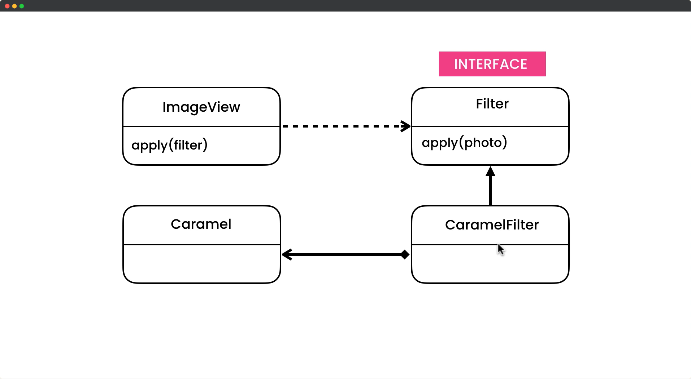

# Adapter Design Pattern

## Description

The Adapter design pattern is a structural design pattern that allows objects with incompatible interfaces to work together. It acts as a bridge between two incompatible interfaces by translating the interface of one object into another interface that the client expects. This pattern is useful when you have an existing class that cannot be modified to match the interface of another class, or when you want to reuse existing code in a new context. The Adapter pattern can make it easier to integrate new components into existing code, or to make legacy code work with modern systems.

## UML for Adapter Pattern

