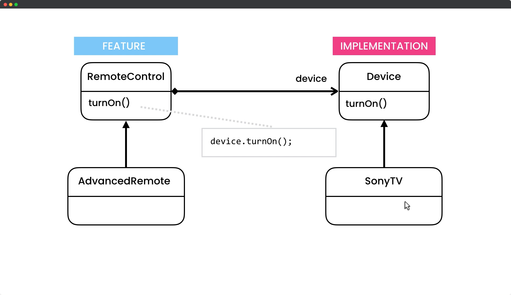

# Bridge Design Pattern

## Description

The Bridge pattern is a design pattern used in software engineering that is used to decouple an abstraction from its implementation so that both can be modified independently. The pattern achieves this by creating two separate abstraction and implementation hierarchies and connecting them using a bridge interface.

In the Bridge pattern, the abstraction and implementation are designed to be independent of each other. The abstraction represents the high-level functionality of a class, while the implementation provides the low-level details of how that functionality is implemented. By separating these two concerns, the Bridge pattern allows them to be developed and tested independently.

The Bridge pattern is useful in situations where there is a need for multiple variants of a class or system, each with its own set of features or capabilities. By using the Bridge pattern, you can create a flexible and extensible design that allows for easy customization and adaptation to changing requirements.

## UML for Bridge Pattern

