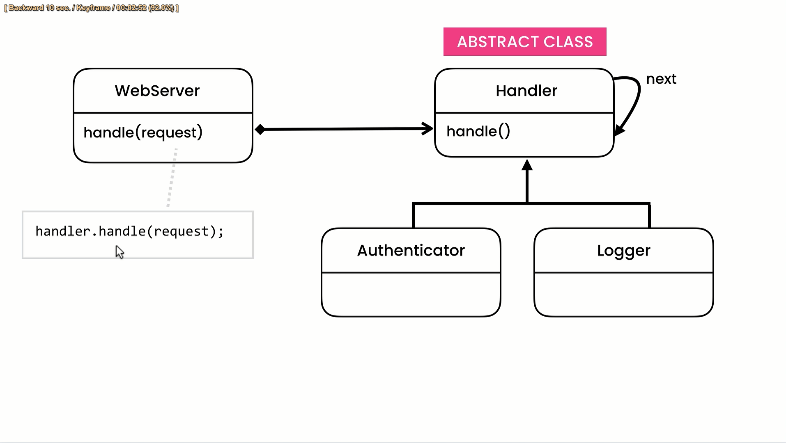

# Chain of Responsibility Design Pattern

The Chain of Responsibility design pattern is a behavioral pattern that allows an object to pass a request along a chain of potential handlers until one of them handles the request. In this pattern, each handler has the ability to handle the request or pass it to the next handler in the chain. The request flows through the chain until it is processed or until it reaches the end of the chain with no handler capable of processing it.

The main idea behind the Chain of Responsibility pattern is to decouple the sender of a request from its receiver by allowing multiple objects to have a chance to handle the request. This promotes loose coupling and flexibility in the system, as the sender doesn't need to know which object will ultimately handle the request.

The Chain of Responsibility pattern is useful in scenarios where there are multiple objects that can handle a request, but the specific handler is unknown or may vary dynamically. It is commonly used in event-driven systems, user interfaces, and logging frameworks, where the request needs to be processed by different components depending on the specific conditions.

## The Importance of the Chain

The important aspects of the Chain of Responsibility pattern include:

1. Decoupling: The pattern allows for the decoupling of the sender and receiver of a request, as the sender doesn't need to know the exact receiver in advance.

2. Flexibility: The chain can be dynamically modified or extended during runtime, allowing for greater flexibility in handling requests.

3. Extensibility: New handlers can be added to the chain without modifying existing code, making it easy to extend the behavior of the system.

4. Responsibility assignment: Each handler is responsible for deciding whether to handle a request or pass it to the next handler. This allows for the separation of concerns and promotes single-responsibility principle.

5. Order of handlers: The order of the handlers in the chain determines the sequence in which they are evaluated. Careful consideration is needed to define the appropriate order to ensure correct handling.

By utilizing the Chain of Responsibility pattern, you can design systems that are more flexible, maintainable, and scalable. It promotes the idea of "loose coupling" and helps to simplify the codebase by dividing the responsibilities among different objects.

## UML for Iterator Pattern

