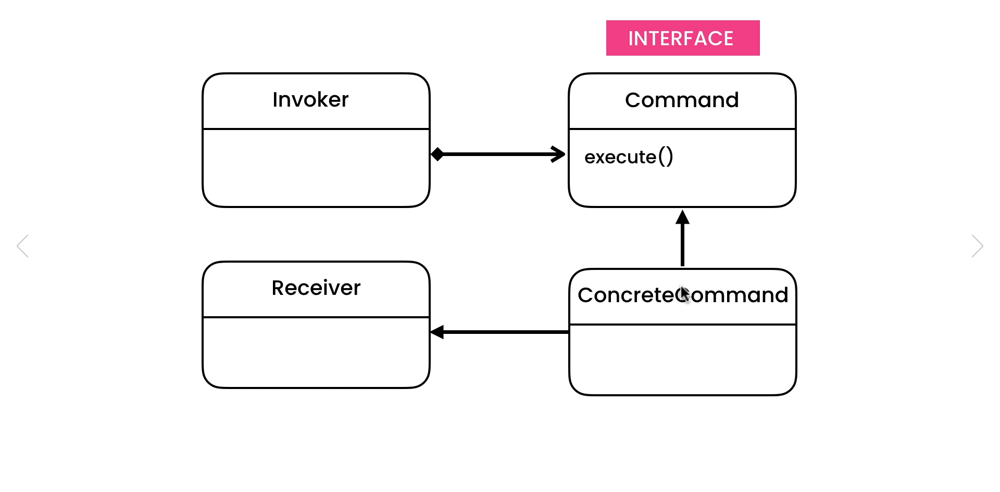

# Command Design Pattern

## Description

### The Problem

Suppose You have design a Framework, This Framework have some Tools, Like Button for Example. Your Framework the Developer will use It in There Projects. Our Button have an `click()` Function which will control in Button actions So we should make `click()` Function dependent on the Developer.

### The Solution

Command Pattern is Very useful in Cases Like This, So in this Code Source we will Implement the Command Pattern.

## UML for Command Pattern

