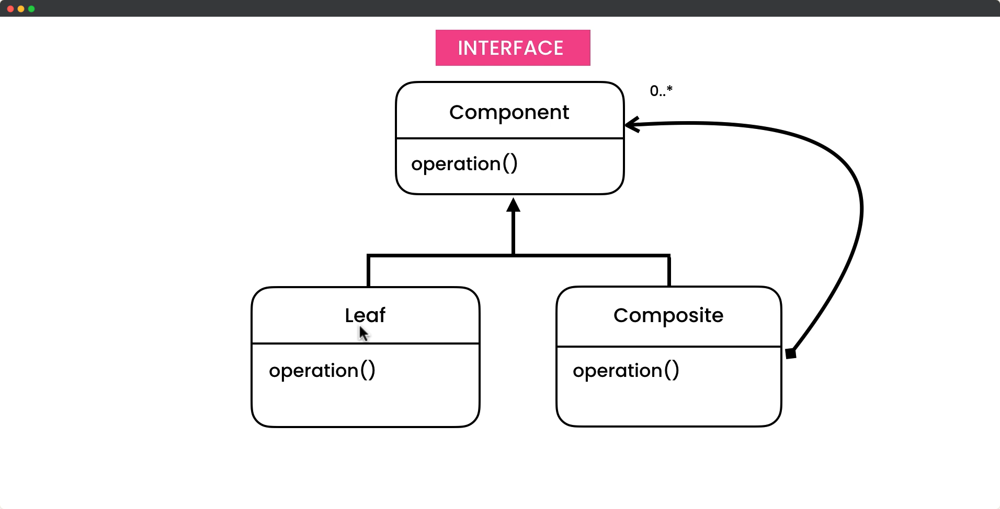

# Composite Design Pattern

## Description

The Composite design pattern is a structural design pattern that allows you to treat individual objects and groups of objects uniformly by organizing them into a tree structure. It lets clients treat individual objects and compositions of objects in a consistent manner, making it easier to work with hierarchical structures of objects. The pattern is useful for building recursive structures, such as directory structures or nested user interfaces, where objects can have sub-objects that may themselves have sub-objects, and so on. The Composite pattern can simplify code and improve flexibility, making it a popular choice for building complex systems.

## UML for Composite Pattern

