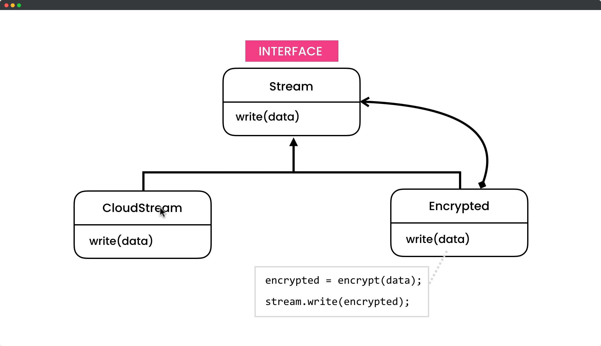

# Decorator Design Pattern

## Description

The Decorator Pattern is a design pattern that allows behavior to be added to an individual object, either statically or dynamically, without affecting the behavior of other objects from the same class. It is used to extend the functionality of an object at runtime without subclassing.

In this pattern, the decorator class wraps the original class and provides additional functionality or modifies the behavior of the original class. This pattern provides a flexible alternative to subclassing for extending functionality.

The key benefits of the Decorator Pattern include:

- It allows adding new behavior to an object without changing its code.
- It allows the addition of several behaviors to an object.
- It follows the Open-Closed principle of SOLID design principles.

In summary, the Decorator Pattern is a powerful design pattern for adding new behavior to an object at runtime, without the need to change the code of the original object. This allows for more flexible and adaptable code, which is easier to maintain and extend over time.

## UML for Decorator Pattern

