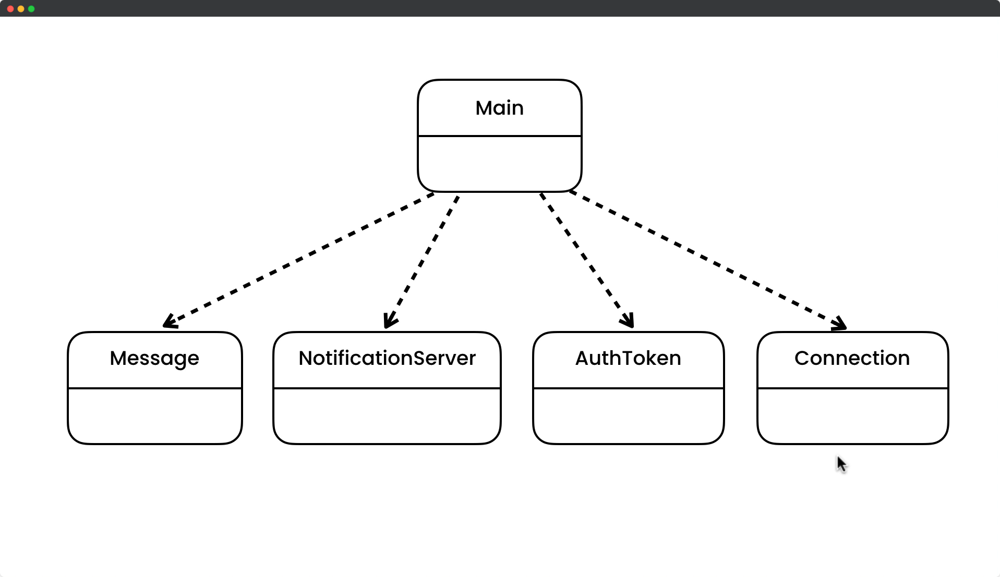
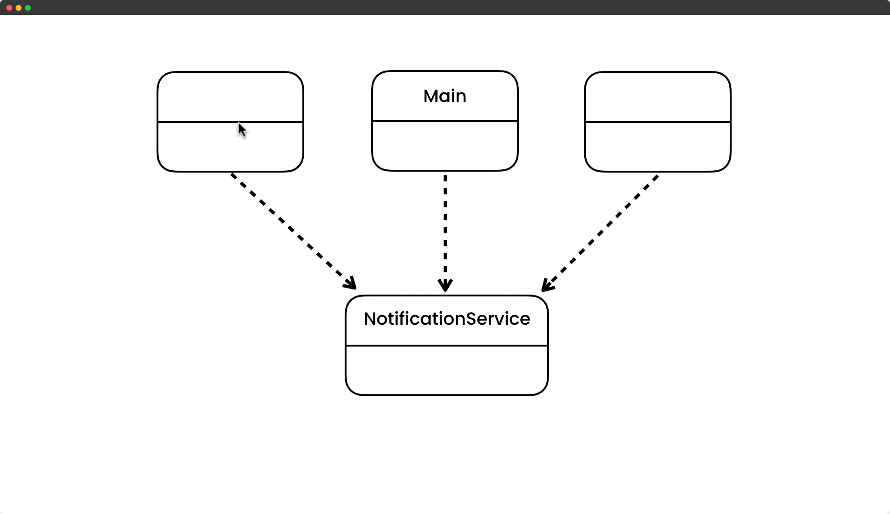

# Facade Design Pattern

## Description

The Facade Pattern is a software design pattern that provides a simplified interface to a larger and more complex set of classes or system. It serves as a middleman between a client and the underlying classes or system, allowing the client to interact with the system in a more convenient and intuitive way. The Facade Pattern hides the complexity of the system and provides a unified interface that makes it easier for clients to use. This pattern promotes loose coupling between the client and the system, which can improve the maintainability and scalability of the system. Overall, the Facade Pattern is useful when dealing with complex systems that need to be abstracted and simplified for ease of use.

## UML for Facade Pattern

