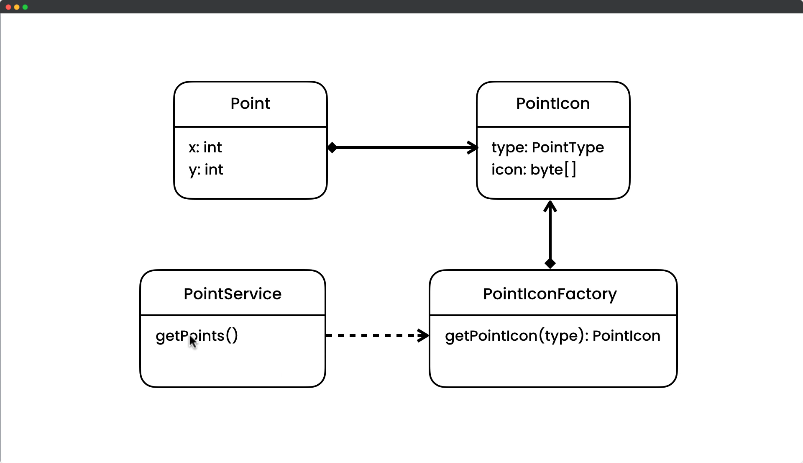

# Flyweight Design Pattern

## Description

The Flyweight pattern is a software design pattern that is used to minimize the memory usage and improve the performance of an application by sharing objects that have common state. The pattern is typically used in situations where there are a large number of objects that are created, and the cost of creating each object is high in terms of memory and performance.

In the Flyweight pattern, objects are divided into two types: intrinsic and extrinsic. Intrinsic objects contain shared data that can be shared among multiple instances of the same class. Extrinsic objects contain data that is unique to each instance and cannot be shared.

The Flyweight pattern works by creating a factory object that creates and manages the shared intrinsic objects. When a new object is requested, the factory object first checks if an object with the same intrinsic state already exists. If it does, the existing object is returned. If it does not, a new object is created and added to the pool of shared objects.

The benefits of using the Flyweight pattern include:

- Reduced memory usage: By sharing objects that have common state, the memory usage of an application is reduced.
- Improved performance: By reusing existing objects instead of creating new ones, the performance of an application is improved.
- Simplified code: The Flyweight pattern separates the intrinsic and extrinsic state of objects, making the code easier to understand and maintain.

The Flyweight pattern is commonly used in graphical applications such as computer games and image processing software, where there may be a large number of objects that need to be created and managed.

## UML for Flyweight Pattern

