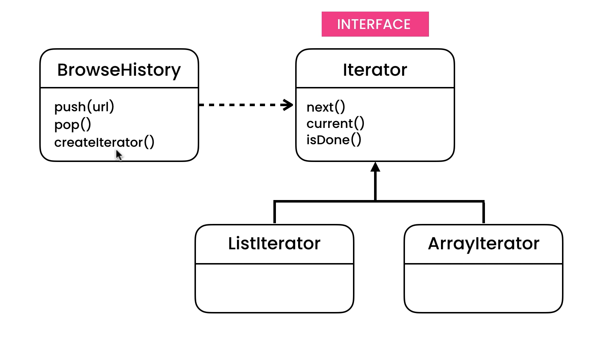

# Iterator Design Pattern

## Description

Suppose You have an History Object, and It Have 2 Methods:

- push()
- pop()

And You Need to implement Iterating Method to Iterate over Histroy URLs and Print It. So You think that Array Data Structure is an Suitable for Storage This.

But suppose that in The Future You would like to Change History URLs Data Structure from Array to Fixed Array or Linked List...etc. Here You will Face A big Problem.

The Problem that You should change your Source Code in Your BrowserHistroy Class and in the Customer Implementation. and this is Imposible. So Changing in You Source Code will break changes in you Application, and Here Iterator Pattern comes to Play.

Iterator Give to The Customer a Fixed API Iterator and desnot change if You Change in You Source Code Implementations.

## UML for Iterator Pattern

