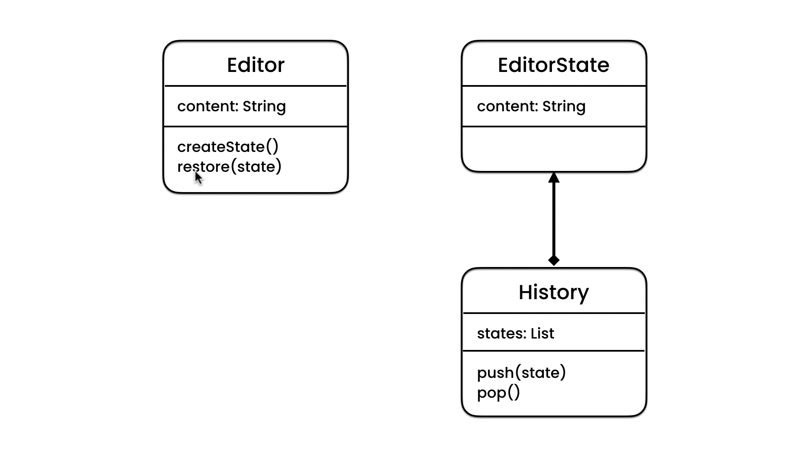

# Memento Design Pattern

## Description

Suppose You have an **Document** Programm Like _Microsoft Word_ or _NotePad_.
You Application have and _content_ filed which refers to what you write in the Application.
A one Day You decide to add undo Feature to Your Program, So How we can do That ??

```typescript
class Document {
  private content: string;

  public write(content: string) {
    this.content = content;
  }
}
```

Ok, We can make and another Filed and in every write process, we can assign old content and then we can assign new content, like this:

```typescript
class Document {
  private content: string;
  private prevContent: string;

  public write(content: string) {
    this.prevContent = this.content;
    this.content = content;
  }

  public restore() {
    this.content = this.prevContent;
  }
}
```

Right But this is suitable for Undo one Step , So if We want so Undo Multi Steps in Your Programm.
You will Said: It is Very Easy, I can replace the **prevContent** Filed with **Stack** Data Structure and then we can restore More than One Step, Like This:

```typescript
class Document {
  private content: string;
  private prevContents: string[];

  public write(content: string) {
    this.prevContents.push(this.content);
    this.content = content;
  }

  public restore() {
    this.content = this.prevContents.pop();
  }
}
```

Ammazing, But if what if You added a New Filed in the Feature like _title_ Filed, How You can
Handle This, The Solution Here is the same as Previous, We will define New Stack for title Filed.

```typescript
class Document {
  private content: string;
  private prevContents: string[];

  private title: string;
  private prevTitles: string[];

  // Code...
}
```

But did You Notice that we define a lot of Stacks which will make our Application Very Complex, So what is The Solution Here ?.

### The Solution

The Solution here is Using Memento Design Pattern.
Memento Pattern is Based on Three Components:

- **Programm:** Document Application
- **State:** This is a Snapshot of all States or Fields that You want to Undo in Them.
- **History:** This is the Class that Control in Our States like Pushing and Popping States.

## UML for Memento Pattern

<div style="width: 100%; display: flex; justify-content: center; align-items: center; border-radius: 15px;">

</div>
