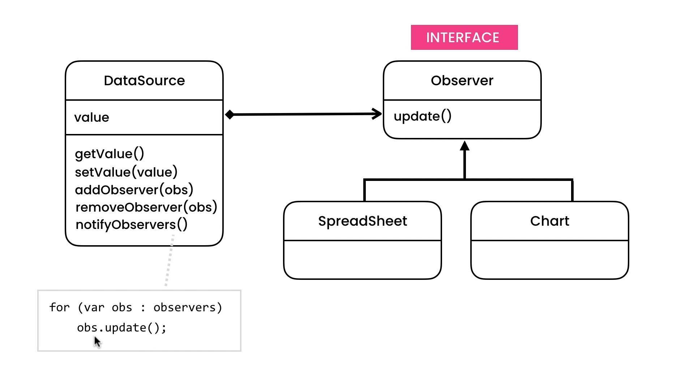
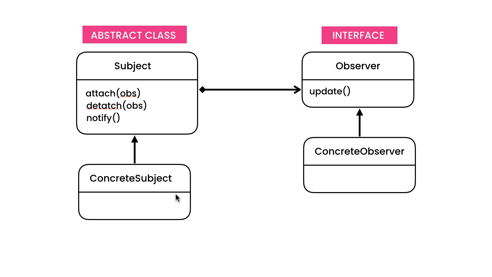

# Observer Design Pattern

## Description

If you work on **Microsoft Excel** Programm, You should know that you can connect a lot of sheets and Charts based on Some Data. So Now suppose that you need to make an A Programm Like Excel. So we Now have an Three Parts:

- `Data Source`
- `Spread Sheet`
- `Chart`

Our Data Source is Like Following:

```typescript
class DataSource {
  private value: string;

  public get getValue() {
    return this.value;
  }

  public set value(value: string): string {
    return this.value;
  }
}
```

### The Problem

Our Problem Now is When we Change the value of The **Data Source** Class **Spread Sheet** and **Chart** Classes Should Be Notified and Know That Value Changed.

### The Solution

Observer Pattern is The Best Solution in this Setuation.
So in This Example we will Implement Observer Pattern.

## UML for Observer Pattern

<div style="width: 100%; display: flex; justify-content: center; align-items: center; border-radius: 15px; gap: 10px; flex-direction: column;">


</div>
