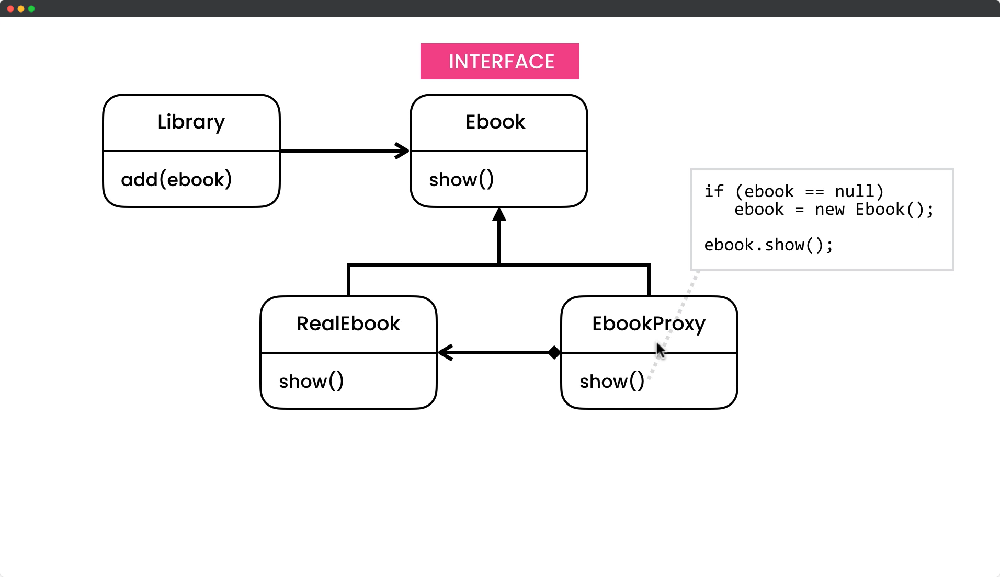

# Proxy Design Pattern

## Description

The Proxy design pattern is a behavioral pattern in software engineering that provides a substitute or placeholder for another object. It allows a client object to interact with the proxy object as if it were the real object, without the client being aware of the actual implementation details.

In essence, the Proxy pattern is used when you want to control access to an object, or when you want to add extra functionality to an object without changing its interface. The proxy object acts as an intermediary between the client and the real object, and it can perform additional tasks such as caching, logging, or access control.

There are different types of proxy patterns, such as remote proxies, virtual proxies, protection proxies, and smart proxies. Remote proxies are used to access objects that are located on remote machines, virtual proxies are used to create expensive objects on demand, protection proxies are used to control access to sensitive objects, and smart proxies are used to add additional functionality to an object without changing its interface.

Overall, the Proxy pattern is a powerful tool for managing object interactions and enhancing object functionality in a flexible and transparent way.

## UML for Proxy Pattern

