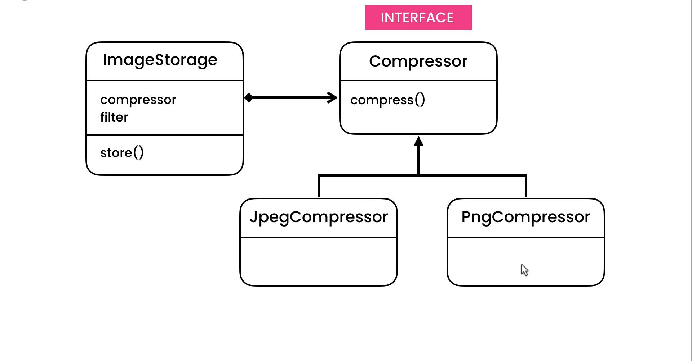

# Strategie Design Pattern

## Description

Suppose You have an **ImageStorage** Class, and It Have 2 Fileds:

- `filter`
- `compressor`

and main metho called `store()`.

```typescript
enum Filter {
  HIGHT_CONTRAST,
  BLACK_AND_WHITE,
}

enum Compressor {
  JPG,
  PNG,
}

class ImageStorage {
  filter: Filter;
  compressor: Compressor;

  constructor(compressor: Compressor, filter: Filter) {
    this.filter = filter;
    this.compressor = compressor;
  }

  stor(fileName: string): void {
    // Code...
  }
}
```

Above Code is Our Image Storage Class, Now we need to implement `store()` Method, So We can do this job like this:

```typescript
enum Filter {
  HIGHT_CONTRAST,
  BLACK_AND_WHITE,
}

enum Compressor {
  JPG,
  PNG,
}

class ImageStorage {
  filter: Filter;
  compressor: Compressor;

  constructor(compressor: Compressor, filter: Filter) {
    this.filter = filter;
    this.compressor = compressor;
  }

  stor(fileName: string): void {
    // Compressing Process
    if (this.compressor === Compressor.JPG) {
      console.log(`Compress (${fileName}) With JPG Compressor...`);
    } else if (this.compressor === Compressor.PNG) {
      console.log(`Compress (${fileName}) With JPG Compressor...`);
    }

    // Filtering Process
    if (this.filter === Filter.BLACK_AND_WHITE) {
      console.log(`Filter (${fileName}) With Black and White Filter...`);
    } else if (this.compressor === Compressor.HIGHT_CONTRAST) {
      console.log(`Filter (${fileName}) With High Contrast Filter...`);
    }
  }
}
```

### The Problem

Exellant, Now we can Store Our Files By The Application. But There is a small Problem Here. What is This Problem? ...

Ok, The Problem will appear if we want to Implement another filed like or new filter or compressor, because we will need to implement a lot of **if:else** statements.

### The Solution

So to Solve this Problem we can Use **Strategy Pattern**.
Startegy Pattern devides the Application to a group of Classes called **Strategies**, So our Strategies in This Programm will be:

- **Strategie 1**: Compressor
- **Strategie 2**: Filter

So in this Files we will Implements Starteige Pattern.

## UML for Strategie Pattern

<div style="width: 100%; display: flex; justify-content: center; align-items: center; border-radius: 15px;">

</div>
