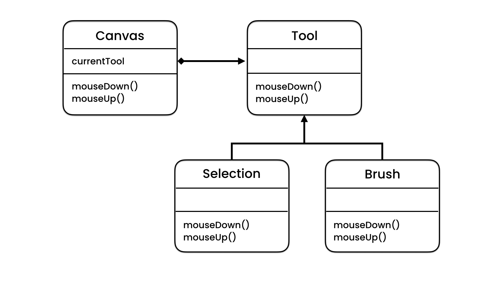

# State Design Pattern

## Description

Suppose You have an **Phootos Editor** Program and you have an **Canvas** This Canvas to Draw on It, and You have 3 Tools:

- _Brush_ Tool
- _Erase_ Tool
- _Selection_ Tool

You Editor Have an Two Method or Functions:

- `mouseUp()`
- `mouseDown()`

To Implement This We will have an State filed in Context Class and This State will be either "Brush", "Erase", or "Selection".

```typescript
enum Tool {
  SELECTION,
  ERASE,
  BRUSH,
}

class Context {
  tool: string;

  public selectTool(tool: Tool) {
    this.tool = tool;
  }

  public mouseUp() {
    if (tool === Tool.SELECTION) {
      console.log("Mouse Up: Selection Tool.");
    } else if (tool === Tool.ERASE) {
      console.log("Mouse Up: Erase Tool.");
    } else if (tool === Tool.BRUSH) {
      console.log("Mouse Up: Brush Tool.");
    }
  }

  public mouseDown() {
    if (tool === Tool.SELECTION) {
      console.log("Mouse Down: Selection Tool.");
    } else if (tool === Tool.ERASE) {
      console.log("Mouse Down: Erase Tool.");
    } else if (tool === Tool.BRUSH) {
      console.log("Mouse Down: Brush Tool.");
    }
  }
}
```

### The Problem

Now our Editor is Fine, But think with Me, If in the future you wanted to add More Tools, This will increase your **if:else** conditions to fear ammount, So we need a Solution for This Problem.

### The Solution

Here we can use State Pattern, State Pattern help us when our design have more than Methods that dependent on The Same State.

So we can define our Components like this:

- State: [Tool: "Erase", "Brush" or "Selection"]
- Methods: [mouseUp(), MouseDown()]

So Know We can Implement our State Design Pattern.

## UML for State Pattern

<div style="width: 100%; display: flex; justify-content: center; align-items: center; border-radius: 15px;">

</div>
