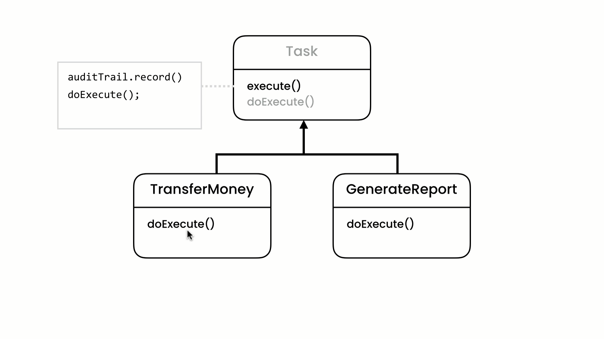

# Template Design Pattern

## Description

Suppose You have a System, like **Bank System** and Have an Class called **Aduit Trail**.
Your System have an Multible Tasks to Finish an Specefic Operation. In this Example we will have one Task called **Transfer Money**.
So we need in Every Task we need to Know which Aduit Trail that Record This Task, We can Implement This like:

```typescript
class AduitTrail {
  private name: string;

  constructor(name: string) {
    this.name = name;
  }

  public record() {
    console.log(`Record: ${this.name}`);
  }
}

class TransferMoney {
  private aduitTrail: AduitTrail;

  constructor(aduitTrail: AduitTrail) {
    this.aduitTrail = aduitTrail;
  }

  excute() {
    aduitTrail.record();
    console.log("Tranfer Money Task is Finished!");
  }
}
```

### The Problem

Suppose that in the Feature we want to add Some Extra Tasks, In this Case we need to implement code like **TransferMoneyTask** in here we face an Problem which is the Code Duplication.

### The Solution

Template Pattern is dependent on **Inheritance** Prencipal, So we can Use it in This Case.

## UML for Template Pattern

<div style="width: 100%; display: flex; justify-content: center; align-items: center; border-radius: 15px;">

</div>
