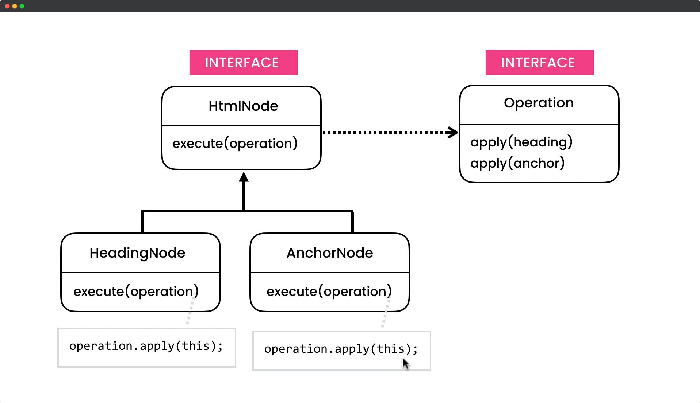

# Visitor Design Pattern

## Description

The Visitor Design Pattern is a behavioral design pattern that allows adding new operations to classes of objects without changing their source code. This is achieved by creating a separate object, called the Visitor, that contains the operation implementations. The objects being operated on are modified to accept the visitor object and call the appropriate operation, passing themselves as an argument. This allows for dynamic modification of the behavior of an object without having to change its class, as the operations are implemented in the visitor. The Visitor pattern is useful when you have a complex object structure and you need to perform operations on the objects that make up the structure, without adding a lot of code to the objects themselves.

## UML for Visitor Pattern

